# Modelado espacio-temporal de eventos sísmicos en Colombia entre 2005 – 2020 mediante procesos de Cox Log-Gaussian y aproximación Bayesiana INLA-SPDE 

**Tesis de Maestría en Ciencias de la Información y Comunicaciones — Énfasis en Geomática**
Universidad Distrital Francisco José de Caldas
**Autor:** Jason Mauricio Romero Ríos
**Periodo de estudio:** 2005 – 2020

---

## Descripción del Proyecto

Este repositorio contiene los scripts de R y Python desarrollados para la preparación del catálogo y el ajuste de un modelo de **Proceso Cox Log-Gaussiano (LGCP)** aplicado a la sismicidad continental de Colombia para el período 2005–2020, usando la metodología Bayesiana **INLA-SPDE**.

El trabajo aborda tres etapas:

1. **Análisis Exploratorio de Datos Espaciales (ESDA):** caracterización descriptiva y visual del catálogo sísmico.
2. **Estimación de distribuciones a priori informativas** mediante simulación de procesos LGCP y entrenamiento de una red neuronal convolucional (CNN-1D).
3. **Ajuste del modelo LGCP espacio-temporal** con INLA-SPDE, incorporando covariables geológicas y el campo espacial latente.

### Hipótesis central

> La ocurrencia de eventos sísmicos en Colombia puede modelarse como un Proceso Cox Log-Gaussiano espacio-temporal, cuya intensidad es explicada parcialmente por factores geológicos (fallas, volcanes, isostasia, topografía) y por un campo Gaussiano latente que captura la dependencia espacial residual.

---

## Estructura del Repositorio

```
lgcp_inla_spde_sismos/
│
├── scripts/                         # Scripts principales del análisis
│   ├── preproccesing.ipynb          # Compilación del catálogo, QC, Mc y declustering (Python)
│   ├── ESDA/
│   │   ├── ESDA.R                   # Análisis exploratorio de datos espaciales
│   │   └── utils.R                  # Funciones auxiliares del ESDA
│   ├── INLA_SPDE/
│   │   ├── utils.R                  # Funciones auxiliares reutilizables
│   │   ├── spatial_model_INLA_SPDE_2020.R              # Modelo espacial (año 2020)
│   │   └── spatio_temporal_INLA_SPDE_2005_2020_final.R # Modelo espacio-temporal
│   ├── SIMULACIONES_LGCP/
│   │   └── simulations_rGLCP.R      # Simulaciones LGCP para entrenamiento CNN
│   ├── ENTRENANDO_CNN/
│   │   ├── CNN_train_and_predict.R  # Entrenamiento CNN y predicción de priors
│   │   └── replot_figures.R         # Regeneración de figuras de la CNN
│   └── ANOMALIAS_GRAVIMETRICAS/
│       └── anomaliasGravimetricas.ipynb  # Cálculo de anomalías isostáticas (Python)
│
├── covariables_rds/                 # Covariables preprocesadas (objetos im de spatstat)
│   ├── script_rds.R                 # Script de preprocesamiento de covariables
│   ├── topografia_im_scaled.rds     # Elevación (MSNM) escalada a [-1,1]
│   ├── isostasia_im_scaled.rds      # Anomalía isostática escalada
│   ├── volcanes_im_scaled.rds       # Distancia a volcanes escalada
│   ├── inversa_im_scaled.rds        # Distancia a fallas inversas escalada
│   ├── normal_im_scaled.rds         # Distancia a fallas normales escalada
│   ├── dextral_im_scaled.rds        # Distancia a fallas dextrales escalada
│   ├── sinestral_im_scaled.rds      # Distancia a fallas sinestrales escalada
│   └── shapeZona_sp                 # Shapefile de la zona de estudio (continental)
│                                    # (también están las versiones sin escalar `*_im.rds`)
│
├── R/                               # Scripts de referencia (INLA-SPDE book)
│   ├── spde-book-functions.R        # Funciones auxiliares del libro SPDE (Lindgren)
│   ├── discrete_gradient.R          # Gradiente discreto para visualización
│   └── ...                          # Otros ejemplos de referencia INLA
│
└── Imagenes/                        # Figuras que ilustran este README
    ├── ESDA/                        # Mapas y gráficos exploratorios
    ├── Metodologia_SPDE/            # Malla triangular y teselación de Voronoi
    ├── CNN_Priors/                  # Entrenamiento CNN y estimación de priors
    ├── Modelos_Espaciales/          # Resultados del modelo espacial (2020)
    └── Modelo_Espacio_Temporal/     # Resultados del modelo espacio-temporal
```

---

## Metodología

### 1. Análisis Exploratorio (ESDA)

Caracterización del catálogo sísmico 2005–2020 del **Servicio Geológico Colombiano (SGC)**, proyectado en **EPSG:3116** (Magna Sirgas Colombia Bogotá). Se analizan distribuciones temporales, espaciales, magnitud y profundidad, junto con las covariables geológicas (fallas, topografía, isostasia, volcanes).

### 2. Simulación LGCP y Estimación de Priors mediante CNN

Para construir distribuciones a priori informativas sobre los hiperparámetros del campo Matérn (rango `r` y desviación estándar `σ`), se adoptó el enfoque de **Vihrs (2022)**, extendido con features de primer orden:

- Se generan **15,000 realizaciones** de procesos LGCP para entrenamiento y **1,500 para test** (semilla independiente), sobre la ventana real de Colombia (EPSG:3116), bajo parámetros aleatorios: `σ² ∈ [0.5, 6.0]`, `scale ∈ [20 km, 300 km]`. La intensidad media `μ` no se muestrea directamente: se muestrea `log E[N] ∈ [log 500, log 60,000]` y se despeja `μ = log(E[N]/|W|) − σ²/2`, garantizando cobertura homogénea de densidades en varios órdenes de magnitud.
- Cada realización se simula con `rLGCP(model = "matern", nu = 1)` en una grilla de 128×128, filtrando patrones con entre 30 y 150,000 puntos.
- Para cada realización se extrae la **curva centrada** `D(r) = L̂(r) − r` de la función L de Besag (corrección de borde, `rmax = 200 km`, **513 valores**) y **8 features de primer orden** que caracterizan la heterogeneidad espacial de la intensidad:
  - **Quadrat-based (3):** varianza de conteos, índice de dispersión (VMR), ratio max/min.
  - **Kernel density (5):** varianza, asimetría, curtosis, entropía normalizada y coeficiente de variación del campo suavizado (bandwidth = 50 km, grilla 64×64).
- La simulación se ejecuta en paralelo (`pbmcapply`, 11 cores) por chunks de 50 realizaciones, guardando resultados incrementales en archivos `.rds`.
- Una **red neuronal CNN-1D** (entrenada externamente en Python con Keras/TensorFlow) aprende la relación entre `D(r)` + conteo `N` + features de primer orden y los parámetros generadores `(μ, σ², scale)`. Se comparan dos arquitecturas: la **CNN de referencia** (Vihrs 2022, solo curva + N) y la **CNN + descriptores** (con las 8 features). La segunda mejora la recuperación de parámetros sobre el test independiente, en particular la escala espacial (`R² = 0.5663 → 0.8276`) y la varianza (`R² = 0.6481 → 0.7603`), rompiendo parcialmente la degeneración entre σ² y scale.
- La CNN se aplica al catálogo real (2020, `N = 14,346` eventos) para obtener las estimaciones a priori.

**Parámetros estimados para Colombia** (modelo CNN + descriptores, adoptado como prior):

| Parámetro | Valor estimado |
|-----------|---------------|
| μ (intensidad media log) | −21.6429 |
| σ² (varianza del campo latente) | 6.0905 |
| scale (spatstat) | 72,346 m (~72 km) |

Estos valores alimentan los **PC-priors** (Penalised Complexity priors) del modelo INLA-SPDE. La conversión a la parametrización de INLA es `σ_INLA = √σ² = 2.468` y `rango_INLA = 2 · scale = 144,692 m (~145 km)`, ya que `rLGCP` (Matérn de spatstat) evalúa la correlación en `z = (h/scale)·√(2ν)`.

#### Arquitectura de la red neuronal (CNN + descriptores)

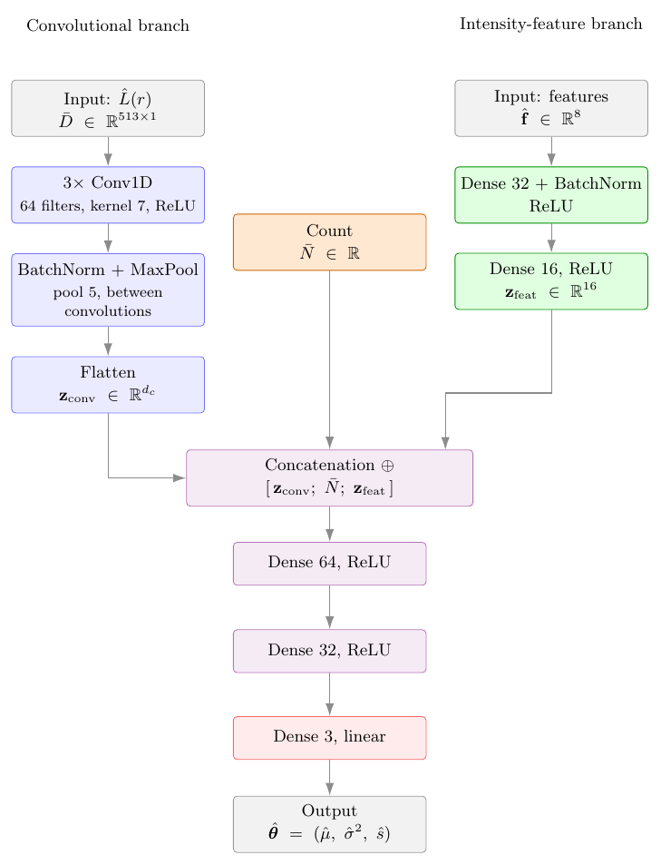

La arquitectura propuesta parte del modelo de referencia de Vihrs (2022) y le añade una **tercera rama** dedicada a los descriptores de intensidad. La decisión de diseño clave es que **el tronco convolucional y el cabezal denso no se modifican** respecto de la referencia, de modo que la comparación entre ambos modelos constituye una **ablación limpia**: cualquier mejora es atribuible únicamente a la incorporación de los descriptores, y no a un aumento de capacidad del modelo.

Se combinan tres ramas:

- **Rama convolucional** — recibe la curva estandarizada `D(r) = L̂(r) − r ∈ ℝ^{513×1}` y aplica tres bloques `Conv1D` de 64 filtros con *kernel* 7 y activación ReLU, cada uno seguido de *Batch Normalization*; los dos primeros incorporan *MaxPooling* de tamaño 5. La dimensión evoluciona `513 → 507 → 101 → 95 → 19 → 13`, y tras `Flatten` produce `z_conv ∈ ℝ^{832}` (832 = 13 × 64).
- **Rama del conteo** — el número total de puntos `N` (estandarizado) entra como un único escalar `Ñ`. Es la principal fuente de información sobre `μ`, ya que `D(r)` está normalizada por la intensidad y es casi insensible a este parámetro.
- **Rama de descriptores** *(la novedad)* — el vector `f ∈ ℝ^8` de descriptores de intensidad pasa por una capa densa de 32 neuronas (ReLU) + *Batch Normalization* y una segunda densa de 16, produciendo `z_feat ∈ ℝ^{16}`.

Las tres ramas se concatenan en `a⁽⁰⁾ = [z_conv; Ñ; z_feat] ∈ ℝ^{849}`, que alimenta un cabezal denso `64 → 32` (ReLU) y una capa de salida lineal de 3 neuronas `(μ̂, σ̂², ŝ)` (activación lineal porque son valores reales sin acotar). El modelo tiene **116,275 parámetros**, de los cuales 58,752 pertenecen al tronco convolucional.

> **Detalle interpretativo:** de los 849 valores que entran al cabezal, 832 (98 %) provienen de la curva `D(r)` y solo 16 (< 2 %) de la rama de descriptores. Que una fracción tan pequeña produzca la mejora documentada refuerza que no se trata de mayor capacidad del modelo, sino de **información de primer orden** que `L̂(r) − r` no puede contener por construcción.

**Entrenamiento:** pérdida MSE sobre los parámetros estandarizados, optimizador Adam (`lr = 10⁻³`), hasta 200 épocas, lotes de 64. Control de sobreajuste con *early stopping* (paciencia 15, restaurando los pesos de la mejor época) y *ReduceLROnPlateau* (factor 0.5, paciencia 7, hasta `10⁻⁶`). No se usa *Dropout* ni `L2`: la normalización por lotes y la parada temprana bastan.

| Parámetro | CNN referencia (R²) | CNN + descriptores (R²) |
|-----------|--------------------|-------------------------|
| μ (intensidad media log) | 0.8099 | **0.8807** |
| σ² (varianza del campo latente) | 0.6481 | **0.7603** |
| scale (escala espacial) | 0.5663 | **0.8276** |

### 3. Modelo LGCP Espacial (año 2020)

Se ajustan cuatro especificaciones del modelo LGCP para evaluar el efecto de los priors informativos y las covariables:

| Modelo | PC-priors | Covariables |
|--------|-----------|-------------|
| M0     | No        | No          |
| M1     | Sí        | No          |
| M2     | No        | Sí          |
| M3     | Sí        | Sí          |

**Covariables finales** (tras análisis de multicolinealidad – VIF < 10):
- Distancia a volcanes
- Distancia a fallas inversas
- Distancia a fallas normales
- Anomalía isostática
- Elevación (MSNM) *(no significativa en el modelo espacial 2020; se vuelve significativa, β ≈ 0.215, al incorporar la componente temporal)*

### 4. Modelo LGCP Espacio-Temporal (2005–2020)

Extensión del modelo espacial incorporando una dinámica temporal **AR(1)** sobre el campo Gaussiano latente, con períodos bienales (8 grupos: 2005-2006, ..., 2019-2020). La estructura de covarianza espacio-temporal usa el producto de Kronecker:

```
Q = Q_T ⊗ Q_S
```

donde `Q_S` es la matriz de precisión espacial SPDE y `Q_T` es la matriz de precisión AR(1).

---

## Resultados Principales

### Efectos fijos del modelo M3 (espacial)

| Covariable      | Media   | IC 95%              |
|-----------------|---------|---------------------|
| Intercepto      | −16.264 | [−17.462, −15.067]  |
| Volcanes        | −3.561  | [−5.084, −2.039]    |
| Falla inversa   | −8.589  | [−10.999, −6.178]   |
| Falla normal    | −3.214  | [−5.324, −1.103]    |
| Isostasia       | −0.187  | [−0.299, −0.074]    |

> Los coeficientes negativos en las variables de distancia indican **mayor intensidad sísmica en zonas próximas** a estas estructuras geológicas (efecto de proximidad).

### Hiperparámetros del modelo espacio-temporal

| Parámetro              | Media     | IC 95%                       |
|------------------------|-----------|------------------------------|
| Rango espacial (ρ)     | 142,063 m | [130,087 m, 154,311 m]       |
| Desviación (σ)         | 2.204     | [2.025, 2.387]               |
| Coeficiente AR(1) (a)  | 0.943     | [0.937, 0.948]               |

> El coeficiente AR(1) de 0.943 indica **fuerte persistencia temporal**: los patrones de sismicidad evolucionan gradualmente entre períodos consecutivos.

### Validación

**Modelo espacial (2020):**
- El modelo **M3** supera consistentemente a M2 en Log-Score y LCPO.
- Bootstrap con B=10,000: `P(M3 > M2) = 100%`, IC 95% completamente positivo `[0.35, 0.78]`.
- Residuos de Pearson sin estructura espacial sistemática (ausencia de sesgo).

**Modelo espacio-temporal (2005–2020):**
- El modelo **M1** (con prior PC) supera a **M0** (sin prior) en Log-Score y LCPO en todos los períodos; ambos incluyen las covariables, por lo que la brecha absoluta es moderada (las covariables ya explican el grueso de la señal) pero **sistemática**.
- Bootstrap por período: `P(Δ > 0) = 100%` en los 8 períodos. La ventaja del prior es **dinámica**: la diferencia media en Log-Score crece de `Δ̄ = 26.1` (2005–2006) a `Δ̄ = 160.0` (2019–2020), amplificándose en los períodos de mayor actividad sísmica.
- La distribución posterior de los hiperparámetros (rango, σ, AR(1)) es coherente con el prior de la CNN pero mucho más concentrada, confirmando que los datos son informativos sin ser forzados por el prior.

---

## Figuras Clave

| Figura | Descripción |
|--------|-------------|
| 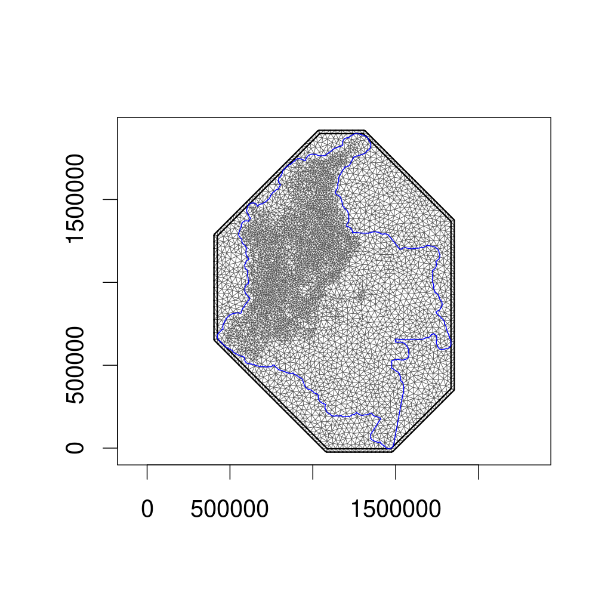 | Triangulación de Delaunay (K=4,309 vértices) |
| 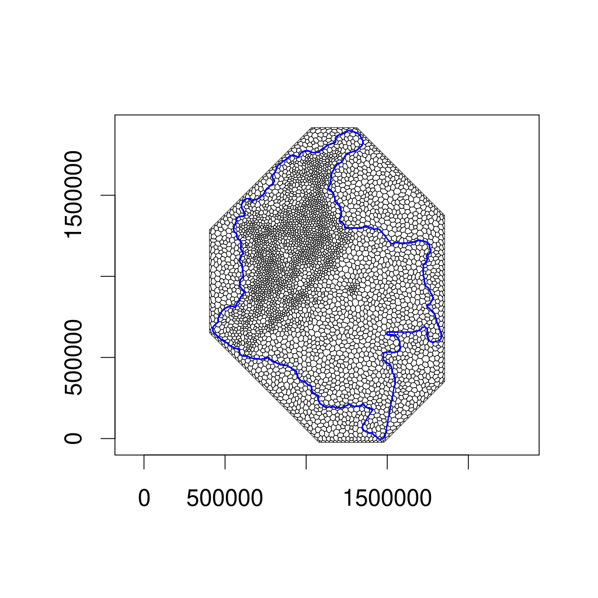 | Teselación de Voronoi para pesos de integración |
|  | Arquitectura CNN-1D propuesta (curva `D(r)` + conteo `N` + 8 descriptores) |
| 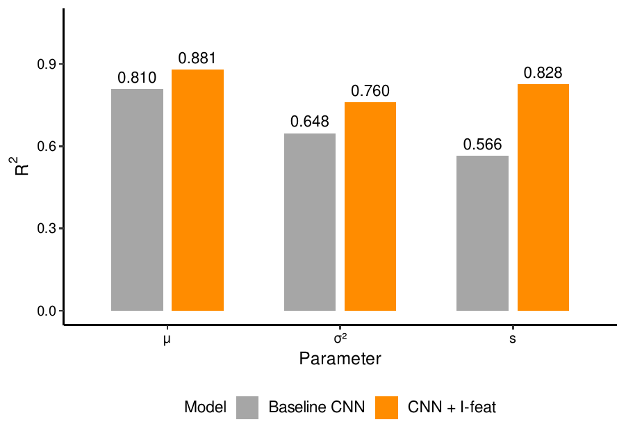 | R² por parámetro: CNN referencia vs CNN + descriptores |
| 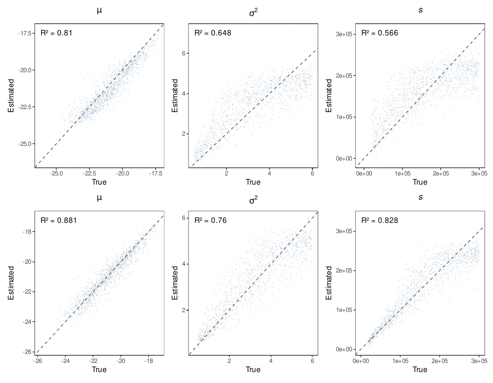 | Valores verdaderos vs predichos de `(μ, σ², scale)` |
| 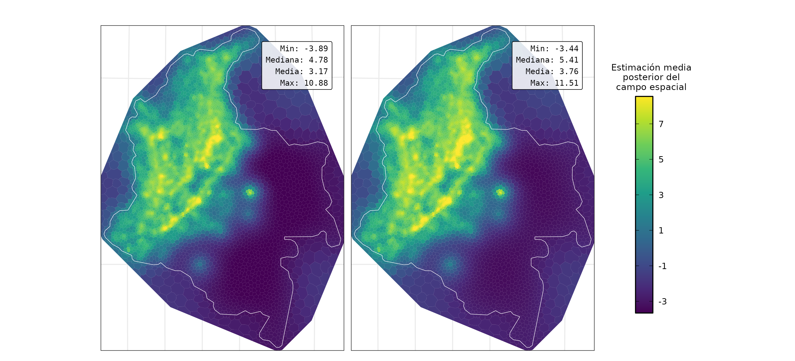 | Campo latente: M0 vs M1 |
| 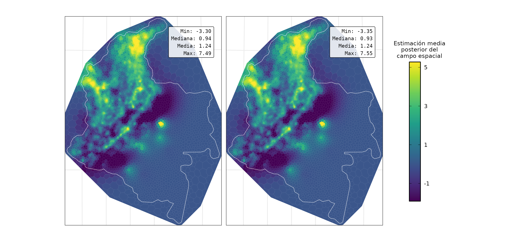 | Campo latente: M2 vs M3 |
| 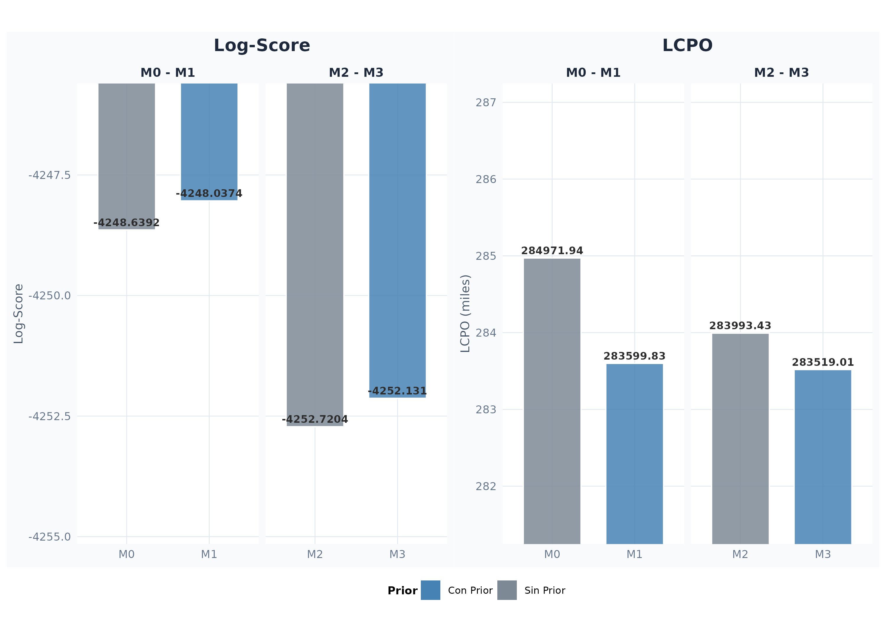 | Comparación Log-Score y LCPO (espacial) |
| 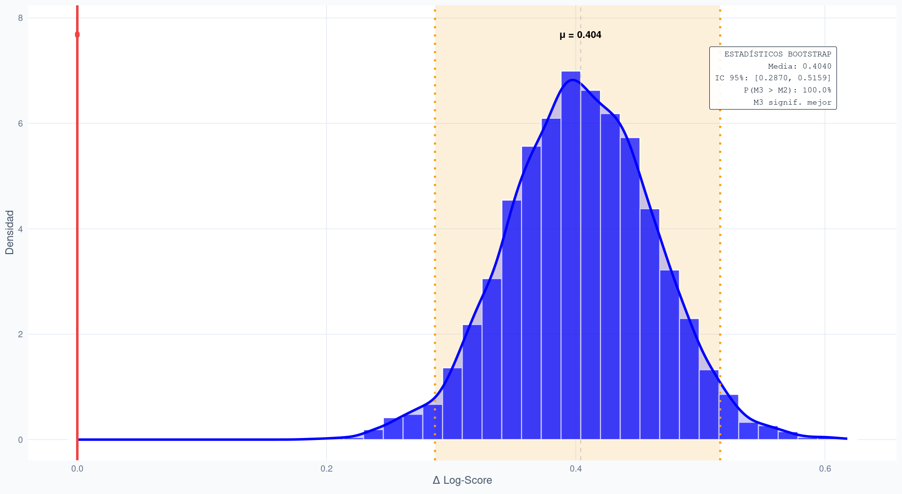 | Distribución bootstrap M3 vs M2 |
| 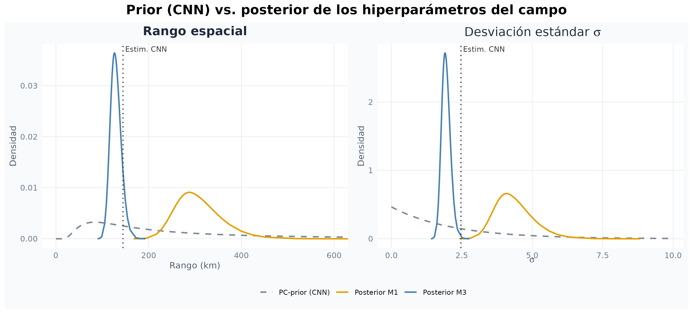 | Prior (CNN) vs posterior de rango y σ |
| 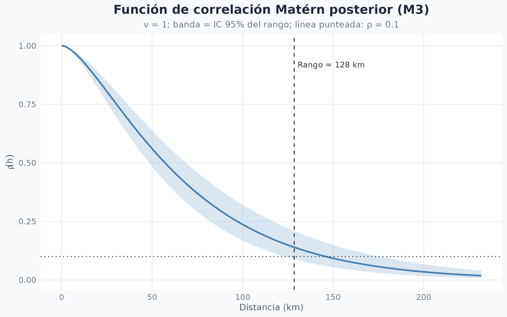 | Función de correlación Matérn posterior (M3) |
| 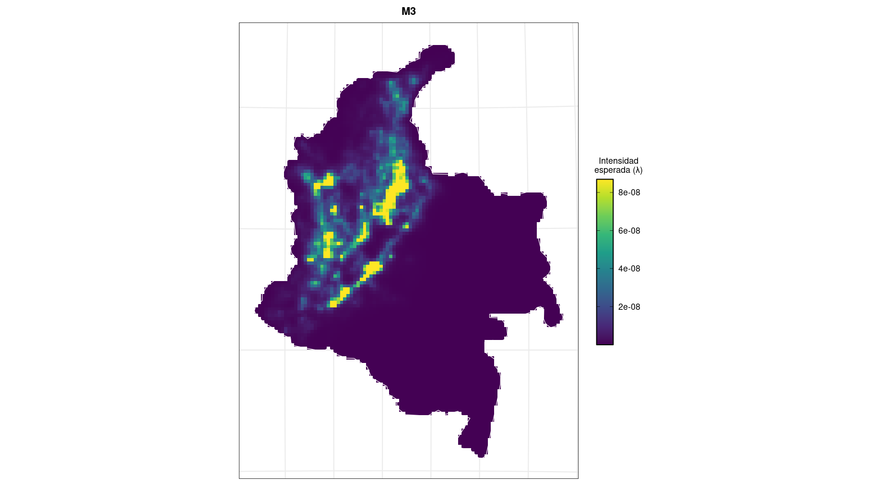 | Intensidad estimada λ(s) – Modelo M3 |
| 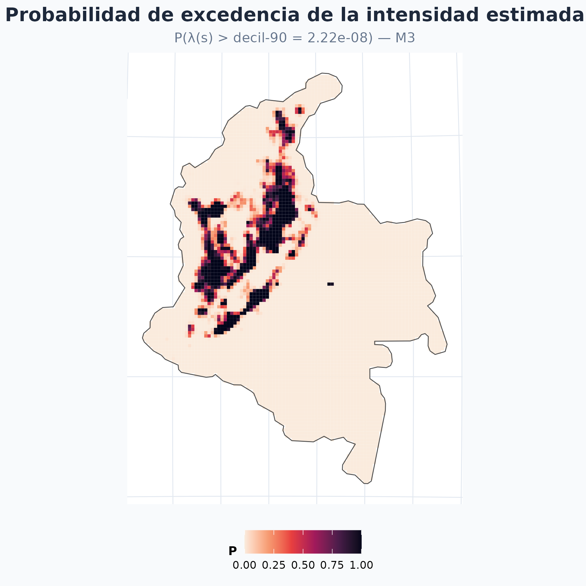 | Probabilidad de excedencia P(λ(s) > decil-90) – M3 |
| 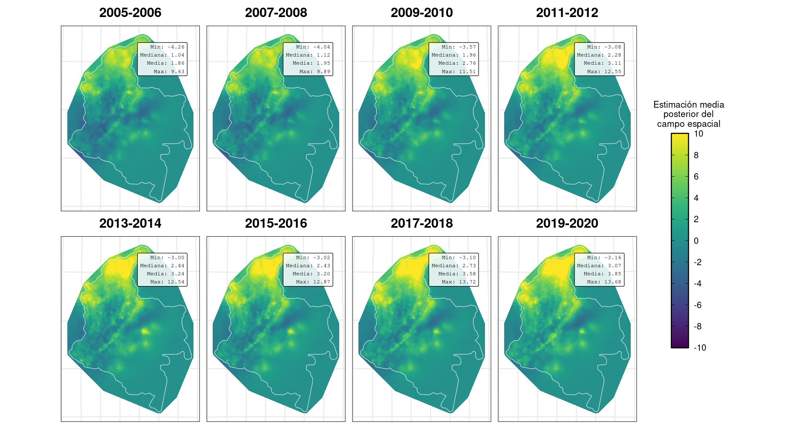 | Campo latente espacio-temporal por período |
| 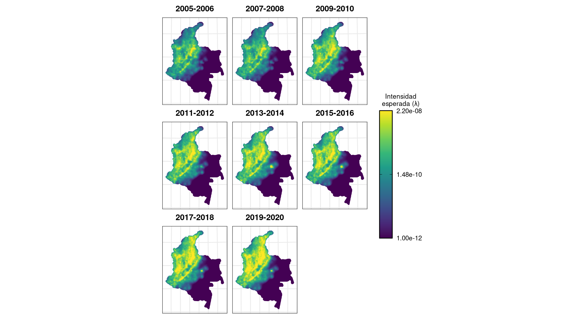 | Intensidad λ(s,t) por período bianual |
| 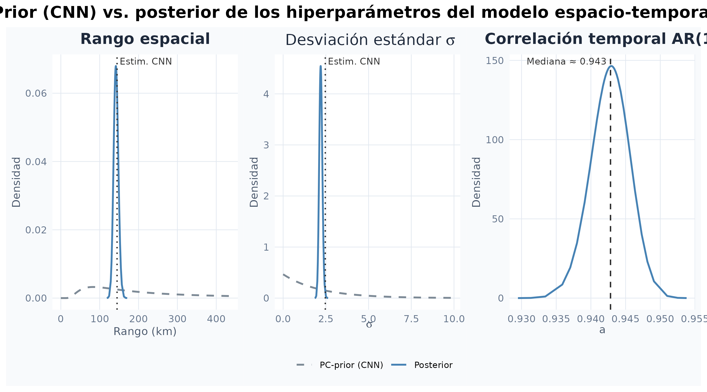 | Prior (CNN) vs posterior: rango, σ y AR(1) |
| 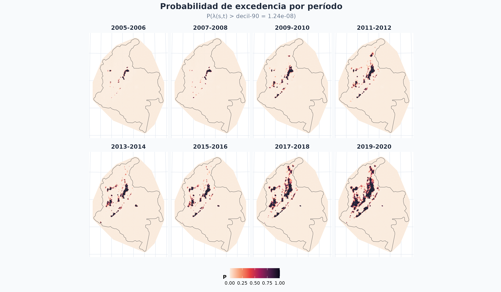 | Probabilidad de excedencia por período |

---

## Dependencias de Python

### Preprocesamiento del catálogo (`scripts/preproccesing.ipynb`)

```python
numpy, pandas      # Cálculo numérico y tabular
geopandas, shapely, pyogrio, pyproj  # Geometría, E/S vectorial y reproyección
seismostats        # Estimación de Mc y b-value (MAXC, KS, b-stability)
bruces             # Declustering de Reasenberg (1985)
matplotlib         # Figuras
```

### Anomalías gravimétricas (`scripts/ANOMALIAS_GRAVIMETRICAS/`)

```python
numpy       # Cálculo numérico
rasterio    # Lectura/escritura de rasters geoespaciales
```

Instalación:
```bash
pip install -r requirements.txt
```

---

## Dependencias de R

### Paquetes requeridos

```r
# Inferencia Bayesiana
library(INLA)       # Integrated Nested Laplace Approximation (>= 24.11.25)
library(fmesher)    # Construcción de mallas FEM para INLA-SPDE
library(inlabru)    # Interfaz de alto nivel para modelos INLA

# Datos espaciales
library(sf)         # Simple Features para vectoriales
library(sp)         # Clases espaciales legacy (requerido por INLA)
library(terra)      # Manejo de rasters
library(raster)     # Rasters (compatibilidad legacy)

# Procesos puntuales
library(spatstat)          # Análisis de procesos puntuales
library(spatstat.geom)     # Geometría de patrones puntuales
library(spatstat.explore)  # Funciones de segundo orden (K, L, G, F)
library(spatstat.random)   # Simulación de procesos (rLGCP)

# Manipulación de datos
library(dplyr)
library(tidyr)
library(purrr)
library(lubridate)

# Visualización
library(ggplot2)
library(viridis)
library(patchwork)
library(cowplot)
library(ggspatial)
library(tidyterra)

# Dependencias adicionales
library(spdep)
library(pbmcapply)   # Paralelización con barra de progreso
library(xtable)      # Tablas LaTeX
library(scales)
```

### Instalación de INLA

INLA no está disponible en CRAN. Instalar desde el repositorio oficial:

```r
install.packages("INLA",
  repos = c(INLA = "https://inla.r-inla-download.org/R/stable"),
  dependencies = TRUE
)
```

---

## Entorno Computacional

| Componente | Especificación |
|------------|---------------|
| Procesador | AMD Ryzen 9 7950X (16 núcleos / 32 hilos) |
| RAM | 64 GB DDR5 |
| GPU | NVIDIA GeForce RTX 4090 (24 GB) |
| SO | Ubuntu 22.04.5 LTS |
| R | Versión 4.5.2 |
| INLA | Versión 24.11.25 |

> Los modelos espaciales tardan ~50 segundos. El modelo espacio-temporal (~8 períodos × 4,309 vértices) tarda ~33 minutos sin priors y ~30 minutos con PC-priors.

---

## Orden de Ejecución

### Paso 0: Cálculo de anomalías gravimétricas isostáticas (Python)
```
scripts/ANOMALIAS_GRAVIMETRICAS/anomaliasGravimetricas.ipynb
```
*Calcula las anomalías isostáticas de gravedad (AIG) a partir de rasters DEM y gravedad observada. Incluye: reducción de Aire Libre, Placa de Bouguer, correcciones topográficas e isostáticas (modelo Airy-Heiskanen), y generación del mosaico final. Requiere: `numpy`, `rasterio`.*

### Paso 1: Preprocesamiento de covariables
```
covariables_rds/script_rds.R
```
*Requiere los datos originales (rasters, shapefiles). Genera los archivos `.rds` en `covariables_rds/`.*

### Paso 1b: Preprocesamiento del catálogo sísmico
```
scripts/preproccesing.ipynb
```
*Compila los históricos del SGC (1995–2020, formatos SEISAN y SeisComP), homogeniza magnitudes a Mw, aplica control de calidad, estima la magnitud de completitud Mc por etapa de red, aplica el declustering de Reasenberg y recorta a la zona continental. Genera `Data/gdf_espacial_2020.gpkg` y `Data/gdf_espacial_2005_2020.gpkg`.*

### Paso 2: Análisis exploratorio
```
scripts/ESDA/ESDA.R
```
*Requiere: catálogo sísmico `.gpkg`, shapefiles de fallas, rasters de topografía e isostasia.*

### Paso 3: Simulaciones LGCP y entrenamiento CNN
```
scripts/SIMULACIONES_LGCP/simulations_rGLCP.R
scripts/ENTRENANDO_CNN/CNN_train_and_predict.R
```
*Genera 15,000 realizaciones LGCP (train) + 1,500 (test, semilla independiente) sobre la ventana continental de Colombia. Para cada realización extrae la curva centrada `D(r) = L̂(r) − r` (513 valores) y 8 features de primer orden (quadrat-based + kernel density). La simulación se paraleliza en 11 cores por chunks de 50 y guarda `.rds` incrementales. La CNN se entrena externamente en Python (Keras/TensorFlow).*

### Paso 4: Modelo espacial (año 2020)
```
scripts/INLA_SPDE/spatial_model_INLA_SPDE_2020.R
```
*Fuente: `scripts/INLA_SPDE/utils.R`. Requiere covariables `.rds`.*

### Paso 5: Modelo espacio-temporal (2005–2020)
```
scripts/INLA_SPDE/spatio_temporal_INLA_SPDE_2005_2020_final.R
```
*Fuente: `scripts/INLA_SPDE/utils.R`. Requiere covariables `.rds`.*

---

## Datos de Entrada

| Dato | Fuente | Formato |
|------|--------|---------|
| Catálogo sísmico 2005–2020 | Servicio Geológico Colombiano (SGC) | `.gpkg` (EPSG:3116) |
| Límite continental Colombia | SGC / IGAC | `.geojson` (EPSG:3116) |
| Topografía (DEM 2000m) | SRTM / NASA | `.tif` (raster) |
| Anomalía isostática | SGC | `.tif` (raster) |
| Fallas geológicas (4 tipos) | SGC | `.shp` |
| Volcanes | SGC | `.shp` |

> **Nota:** Los rasters y shapefiles originales **no están incluidos** en este repositorio por restricciones de tamaño y licencias. Sí están versionados el catálogo sísmico (`Data/EventosColPointsPlanas31162005_2020_continental.gpkg`), el límite continental (`Data/clip_zona_continental_simplificado.geojson`) y las covariables preprocesadas en `covariables_rds/`. Los históricos crudos del SGC que consume `scripts/preproccesing.ipynb` van en `Data/Historicos/` y tampoco se versionan.

---

## Referencias

- Lindgren, F., Rue, H., & Lindström, J. (2011). An explicit link between Gaussian fields and Gaussian Markov random fields: the stochastic partial differential equation approach. *JRSS-B*, 73(4), 423–498.
- Rue, H., Martino, S., & Chopin, N. (2009). Approximate Bayesian inference for latent Gaussian models using integrated nested Laplace approximations. *JRSS-B*, 71(2), 319–392.
- Fuglstad, G.A., Simpson, D., Lindgren, F., & Rue, H. (2019). Constructing priors that penalize the complexity of Gaussian random fields. *JASA*, 114(525), 445–452.
- Simpson, D., Rue, H., Riebler, A., Martins, T.K., & Sørbye, S.H. (2017). Penalising model component complexity: a principled practical approach to constructive priors. *Statistical Science*, 32(1), 1–28.
- Vihrs, N. (2022). Using neural networks to estimate parameters in spatial point process models. *Spatial Statistics*, 51, 100668. https://doi.org/10.1016/j.spasta.2022.100668
- Cameletti, M., Lindgren, F., Simpson, D., & Rue, H. (2013). Spatio-temporal modeling of particulate matter concentration through the SPDE approach. *AStA*, 97(2), 109–131.
- Gómez-Rubio, V. (2020). *Bayesian inference with INLA*. CRC Press.

---

*Repositorio preparado como parte de la Tesis de Maestría, Universidad Distrital Francisco José de Caldas, 2025–2026.*
